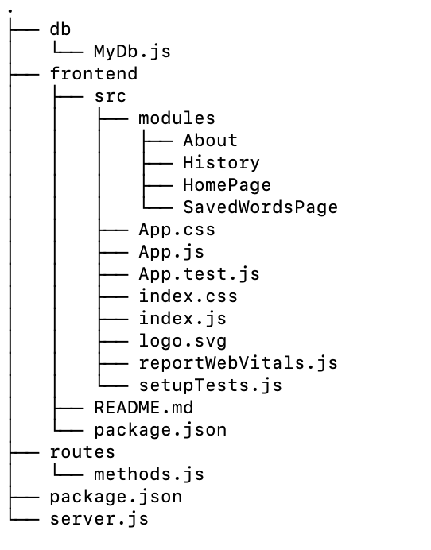

# SiSwati-To-English-Dictionary
This dictionary is the first of its kind. The SiSwati dialect is the native tongue of the people of Eswatini (Swaziland). However, the SiSwati dictionary has not been digitized. This project aims to rectify this, and in so doing, help preserve the language and culture of EmaSwati. This prototype contains approximately 1100 English words and their Siswati definitions. The reason for this modest offering is that the definitions are not all 100% accurate yet. This is due to the fact that they are being read from scans and have to be verified manually. Many more words will be added as this process is completed.
### [Site](https://final-eng-siswati-dictionary.herokuapp.com)
### Directory Structure:

